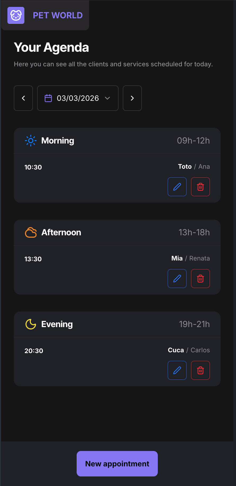

# Pet World

Pet World is a scheduling app for pet shop appointments.  
It allows creating, updating, listing, and deleting appointments by day, grouped by period:

- Morning (09h-12h)
- Afternoon (13h-18h)
- Evening (19h-21h)

## Live Application

This project is hosted on Vercel:

- https://pet-shop-eight-mu.vercel.app/

## Repository Preview

<p align="center">
  
</p>

## Features

- Daily agenda view by selected date.
- Appointments grouped by period (Morning, Afternoon, Evening).
- Create, update, and delete appointments.
- Scheduling allowed only between 09h-12h, 13h-18h, and 19h-21h.
- Prevents double booking for the same date and time.

## Tech Stack

- Next.js 16 (App Router)
- React 19
- TypeScript
- Prisma + PostgreSQL
- Tailwind CSS 4
- Radix UI
- React Hook Form + Zod
- Biome

## Running Locally

### 1) Install dependencies

```bash
npm install
```

### 2) Configure environment variables

Create a `.env` file in the project root with:

```env
DATABASE_URL="your_postgresql_connection_string"
```

### 3) Apply migrations

```bash
npm run prisma:migrate
```

### 4) Start development server

```bash
npm run dev
```

Open `http://localhost:3000` in your browser.

## Available Scripts

- `npm run dev`: Starts the app in development mode.
- `npm run build`: Generates Prisma client, applies deploy migrations, and builds production bundle.
- `npm run start`: Starts the production server.
- `npm run lint`: Runs Biome checks.
- `npm run format`: Formats files with Biome.
- `npm run validate:typecheck`: Runs TypeScript type checks.
- `npm run prisma:migrate`: Runs Prisma migrations in development.
- `npm run prisma:studio`: Opens Prisma Studio.
